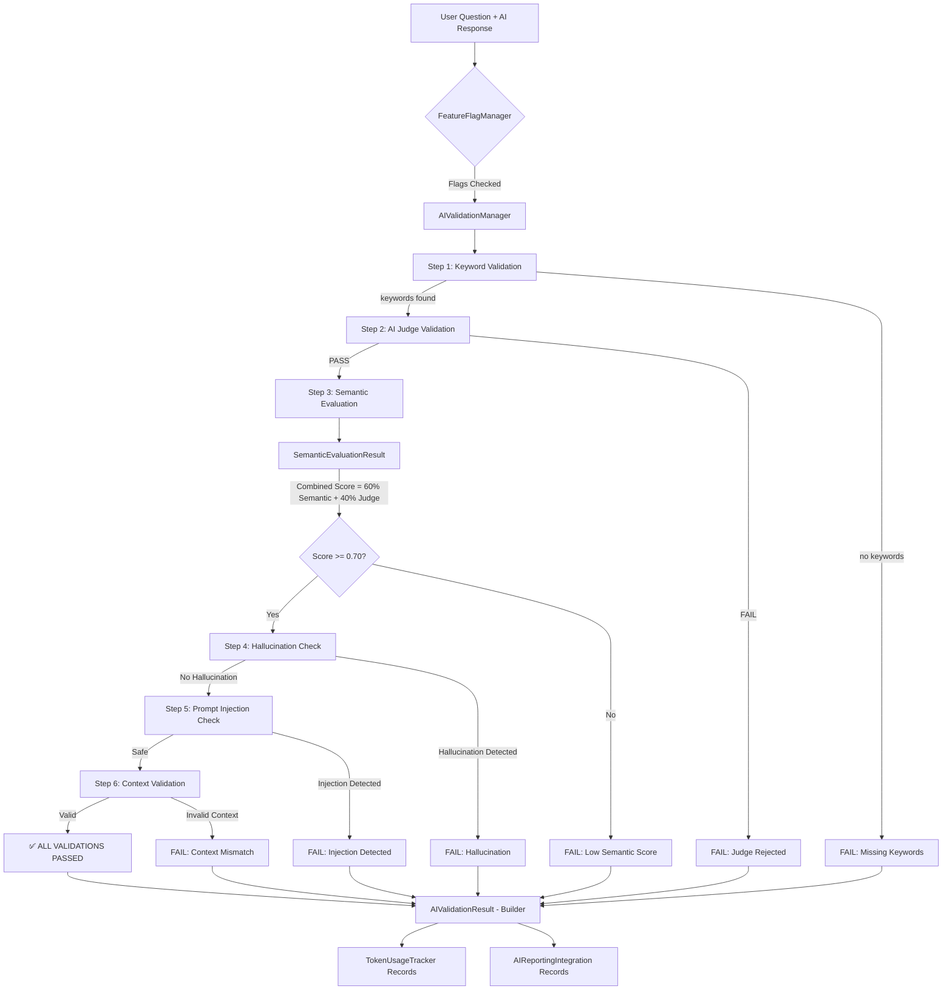
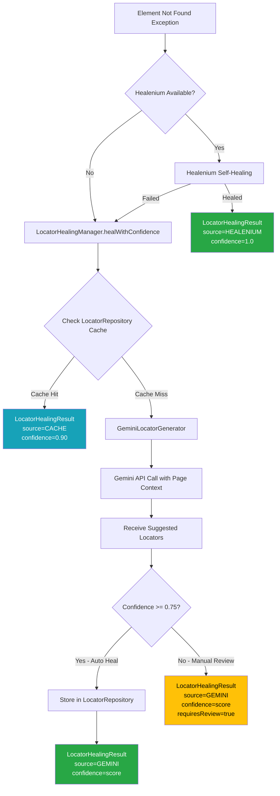
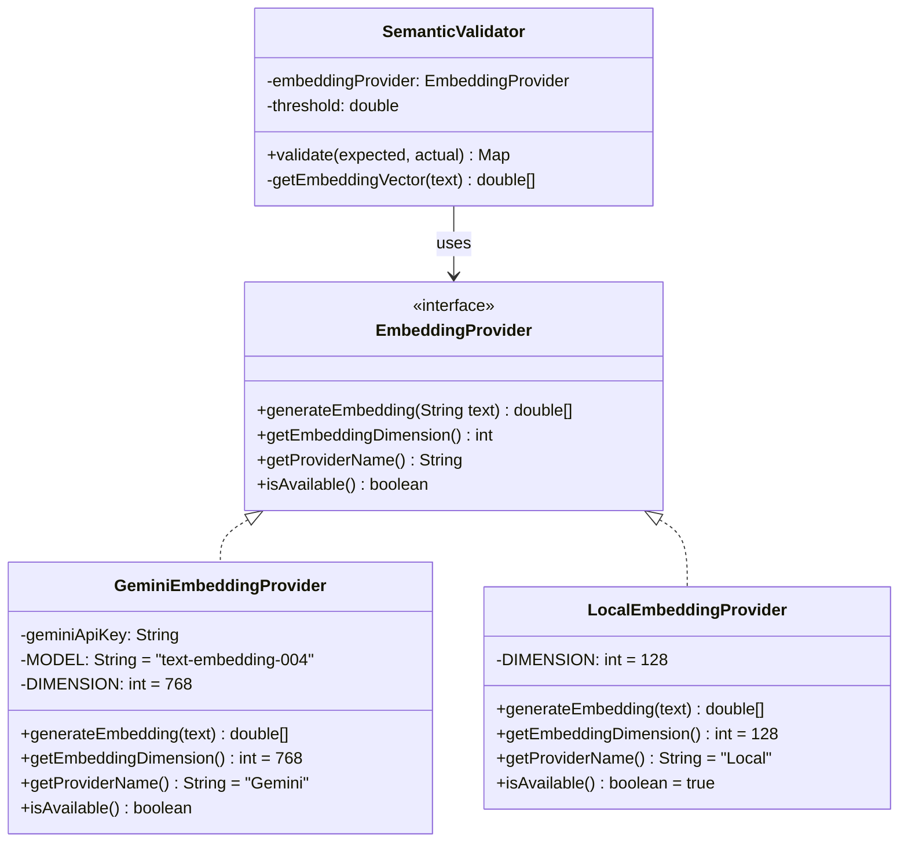
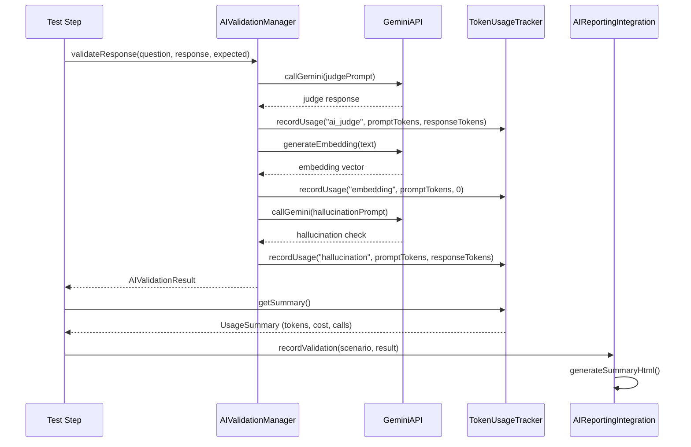
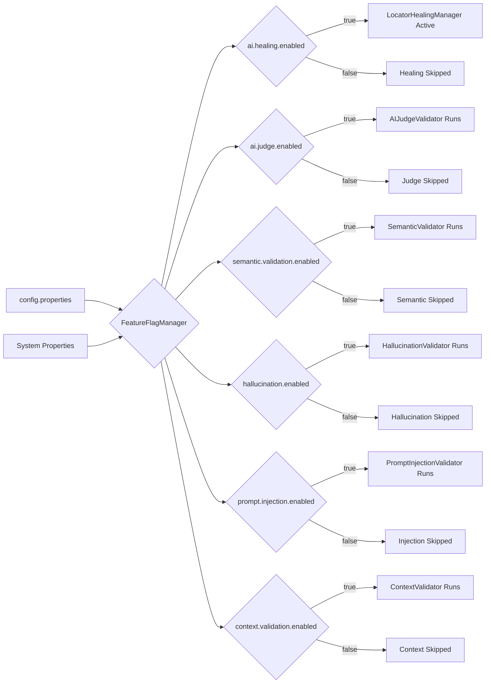
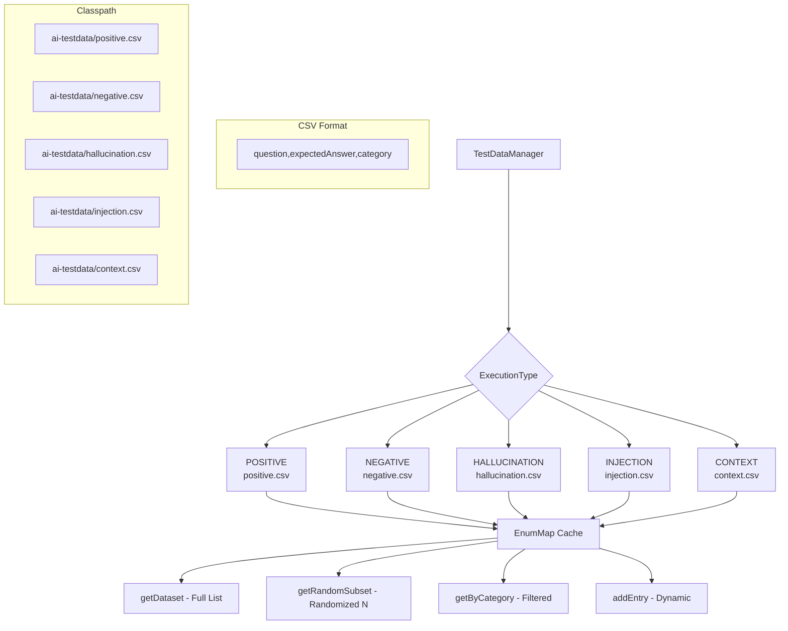
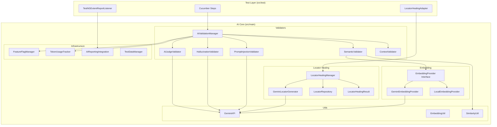

# AI Modules - Architecture Diagrams

## 1. AI Validation Pipeline Flow

## 2. Locator Healing Flow

## 3. Embedding Provider Strategy Pattern

## 4. Token Usage Tracking Flow

## 5. Feature Flag Decision Tree

## 6. TestDataManager Architecture

## 7. Complete System Architecture

