# AI Modules - Dependency Graph & Implementation Order

## Dependency Graph

```mermaid
graph TD
    %% ═══════════════════════════════════════════════════════════════
    %% FOUNDATION LAYER (No dependencies on other AI modules)
    %% ═══════════════════════════════════════════════════════════════
    subgraph "🟢 FOUNDATION"
        F1[LoggerUtil]
        F2[SimilarityUtil]
        F3[FeatureFlagManager]
        F4[config.properties]
        F5[LocalEmbeddingProvider]
        F6[TestDataManager]
        F7[TokenUsageTracker]
    end

    %% ═══════════════════════════════════════════════════════════════
    %% CORE LAYER (Depends on Foundation only)
    %% ═══════════════════════════════════════════════════════════════
    subgraph "🔵 CORE"
        C1[GeminiAPI]
        C2[EmbeddingUtil]
        C3[GeminiEmbeddingProvider]
        C4[LocatorRepository]
        C5[AIReportingIntegration]
    end

    %% ═══════════════════════════════════════════════════════════════
    %% ADVANCED LAYER (Depends on Foundation + Core)
    %% ═══════════════════════════════════════════════════════════════
    subgraph "🟠 ADVANCED"
        A1[SemanticValidator]
        A2[AIJudgeValidator]
        A3[HallucinationValidator]
        A4[PromptInjectionValidator]
        A5[ContextValidator]
        A6[GeminiLocatorGenerator]
    end

    %% ═══════════════════════════════════════════════════════════════
    %% EXPERIMENTAL LAYER (Depends on all layers)
    %% ═══════════════════════════════════════════════════════════════
    subgraph "🔴 EXPERIMENTAL"
        E1[AIValidationManager]
        E2[AIValidationResult]
        E3[SemanticEvaluationResult]
        E4[LocatorHealingManager]
        E5[LocatorHealingResult]
    end

    %% ───────────────────────────────────────────────────────────────
    %% DEPENDENCY EDGES
    %% ───────────────────────────────────────────────────────────────

    %% Foundation → nothing (leaf nodes)
    F4 --> F3

    %% Core → Foundation
    C1 --> F1
    C1 --> F4
    C2 --> F1
    C2 --> F5
    C2 --> C3
    C3 --> F1
    C3 --> F4
    C4 --> F1
    C5 --> F7
    C5 --> F1

    %% Advanced → Foundation + Core
    A1 --> F2
    A1 --> F5
    A1 --> C3
    A2 --> C1
    A2 --> F1
    A3 --> C1
    A3 --> F1
    A4 --> C1
    A4 --> F1
    A5 --> C1
    A5 --> F1
    A5 --> F2
    A6 --> C1
    A6 --> F1

    %% Experimental → All layers
    E1 --> F3
    E1 --> F7
    E1 --> A1
    E1 --> A2
    E1 --> A3
    E1 --> A4
    E1 --> A5
    E3 --> A1
    E3 --> A2
    E4 --> A6
    E4 --> C4
    E4 --> F1
    E5 --> A6

    %% Styling
    style F1 fill:#2ecc71,color:#000
    style F2 fill:#2ecc71,color:#000
    style F3 fill:#2ecc71,color:#000
    style F4 fill:#2ecc71,color:#000
    style F5 fill:#2ecc71,color:#000
    style F6 fill:#2ecc71,color:#000
    style F7 fill:#2ecc71,color:#000

    style C1 fill:#3498db,color:#fff
    style C2 fill:#3498db,color:#fff
    style C3 fill:#3498db,color:#fff
    style C4 fill:#3498db,color:#fff
    style C5 fill:#3498db,color:#fff

    style A1 fill:#e67e22,color:#fff
    style A2 fill:#e67e22,color:#fff
    style A3 fill:#e67e22,color:#fff
    style A4 fill:#e67e22,color:#fff
    style A5 fill:#e67e22,color:#fff
    style A6 fill:#e67e22,color:#fff

    style E1 fill:#e74c3c,color:#fff
    style E2 fill:#e74c3c,color:#fff
    style E3 fill:#e74c3c,color:#fff
    style E4 fill:#e74c3c,color:#fff
    style E5 fill:#e74c3c,color:#fff
```



## Module Classification

| # | Module | Layer | Package | Dependencies |
|---|--------|-------|---------|--------------|
| 1 | LoggerUtil | 🟢 Foundation | `api.utils` | Log4j2 only |
| 2 | SimilarityUtil | 🟢 Foundation | `api.ai.utils` | None (pure math) |
| 3 | FeatureFlagManager | 🟢 Foundation | `api.ai.config` | LoggerUtil, config.properties |
| 4 | config.properties | 🟢 Foundation | `resources/` | — |
| 5 | LocalEmbeddingProvider | 🟢 Foundation | `api.ai.embedding` | EmbeddingProvider interface |
| 6 | TestDataManager | 🟢 Foundation | `api.ai.testdata` | LoggerUtil |
| 7 | TokenUsageTracker | 🟢 Foundation | `api.ai.metrics` | LoggerUtil |
| 8 | GeminiAPI | 🔵 Core | `api.ai.chatbot` | LoggerUtil, RestAssured, config |
| 9 | EmbeddingUtil | 🔵 Core | `api.ai.utils` | LocalEmbedding, GeminiEmbedding, LoggerUtil |
| 10 | GeminiEmbeddingProvider | 🔵 Core | `api.ai.embedding` | RestAssured, LoggerUtil, config |
| 11 | LocatorRepository | 🔵 Core | `api.ai.locator` | LoggerUtil (file I/O) |
| 12 | AIReportingIntegration | 🔵 Core | `api.ai.reporting` | TokenUsageTracker, LoggerUtil |
| 13 | SemanticValidator | 🟠 Advanced | `api.ai.chatbot` | EmbeddingProvider, SimilarityUtil |
| 14 | AIJudgeValidator | 🟠 Advanced | `api.ai.chatbot` | GeminiAPI, LoggerUtil |
| 15 | HallucinationValidator | 🟠 Advanced | `api.ai.chatbot` | GeminiAPI, LoggerUtil |
| 16 | PromptInjectionValidator | 🟠 Advanced | `api.ai.chatbot` | GeminiAPI, LoggerUtil |
| 17 | ContextValidator | 🟠 Advanced | `api.ai.chatbot` | GeminiAPI, SimilarityUtil, LoggerUtil |
| 18 | GeminiLocatorGenerator | 🟠 Advanced | `api.ai.locator` | GeminiAPI, LoggerUtil |
| 19 | AIValidationManager | 🔴 Experimental | `api.ai.validators` | All validators, FeatureFlags, TokenTracker |
| 20 | AIValidationResult | 🔴 Experimental | `api.ai.validators` | TokenUsageTracker (DTO) |
| 21 | SemanticEvaluationResult | 🔴 Experimental | `api.ai.validators` | — (DTO, but conceptual dep on validators) |
| 22 | LocatorHealingManager | 🔴 Experimental | `api.ai.locator` | GeminiLocatorGen, LocatorRepo, FeatureFlags |
| 23 | LocatorHealingResult | 🔴 Experimental | `api.ai.locator` | — (DTO, tight coupling to healing flow) |

## Implementation Order

### Phase 1: 🟢 Foundation (Implement & Test First)
```
Order: F4 → F1 → F2 → F7 → F3 → F5 → F6
```
1. **config.properties** — Add AI configuration keys
2. **LoggerUtil** — Already exists ✅, write unit test
3. **SimilarityUtil** — Already exists ✅, write unit test
4. **TokenUsageTracker** — Already exists ✅, write unit test
5. **FeatureFlagManager** — Already exists ✅, write unit test
6. **LocalEmbeddingProvider** — Already exists ✅, write unit test
7. **TestDataManager** — Already exists ✅, create CSV data + unit test

### Phase 2: 🔵 Core (After Foundation tests pass)
```
Order: C1 → C3 → C2 → C4 → C5
```
8. **GeminiAPI** — Already exists ✅, write integration test (mocked)
9. **GeminiEmbeddingProvider** — Already exists ✅, write integration test (mocked)
10. **EmbeddingUtil** — Already exists ✅, write unit test
11. **LocatorRepository** — Already exists ✅, write unit test
12. **AIReportingIntegration** — Already exists ✅, write unit test

### Phase 3: 🟠 Advanced (After Core tests pass)
```
Order: A1 → A2 → A3 → A4 → A5 → A6
```
13-18. **Validators + GeminiLocatorGenerator** — Write integration tests with mocked GeminiAPI

### Phase 4: 🔴 Experimental (After Advanced tests pass)
```
Order: E2 → E3 → E5 → E1 → E4
```
19-23. **Managers + DTOs** — Write full pipeline integration tests

## What Needs To Be Created (Foundation + Core)

### Config (Foundation):
- `src/main/resources/config.properties` — Add AI keys
- `src/test/resources/config.properties` — Add AI keys for test env

### Test Data (Foundation):
- `src/main/resources/ai-testdata/positive.csv`
- `src/main/resources/ai-testdata/negative.csv`
- `src/main/resources/ai-testdata/hallucination.csv`
- `src/main/resources/ai-testdata/injection.csv`
- `src/main/resources/ai-testdata/context.csv`

### Unit Tests (Foundation):
- `src/test/java/com/mryoda/diagnostics/api/ai/utils/SimilarityUtilTest.java`
- `src/test/java/com/mryoda/diagnostics/api/ai/metrics/TokenUsageTrackerTest.java`
- `src/test/java/com/mryoda/diagnostics/api/ai/config/FeatureFlagManagerTest.java`
- `src/test/java/com/mryoda/diagnostics/api/ai/embedding/LocalEmbeddingProviderTest.java`
- `src/test/java/com/mryoda/diagnostics/api/ai/testdata/TestDataManagerTest.java`

### Unit Tests (Core):
- `src/test/java/com/mryoda/diagnostics/api/ai/chatbot/GeminiAPITest.java`
- `src/test/java/com/mryoda/diagnostics/api/ai/embedding/GeminiEmbeddingProviderTest.java`
- `src/test/java/com/mryoda/diagnostics/api/ai/utils/EmbeddingUtilTest.java`
- `src/test/java/com/mryoda/diagnostics/api/ai/locator/LocatorRepositoryTest.java`
- `src/test/java/com/mryoda/diagnostics/api/ai/reporting/AIReportingIntegrationTest.java`

## Acceptance Criteria

Each module test must verify:
- ✅ Normal operation (happy path)
- ✅ Edge cases (null input, empty string, boundary values)
- ✅ Error handling (invalid config, network failure simulation)
- ✅ Thread safety (where applicable)
- ✅ Immutability (state not modified)
